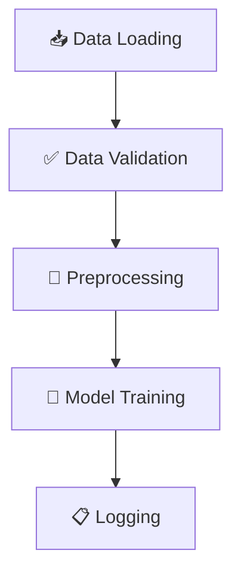

# Credit Card Fraud Detection - Production-Ready MLOps Pipeline

A modular, production-ready MLOps pipeline designed to detect fraudulent credit card transactions using robust and reproducible machine learning practices. This solution adheres to modern MLOps standards, enabling scalability, automation, and reliable deployment.

---

## 📚 Table of Contents

- [🧠 Motivation and Problem Statement](#motivation-and-problem-statement)
- [✨ Key Features](#key-features)
- [🧱 Project Structure](#project-structure)
- [📂 Dataset](#dataset)
- [🧭 DeepWiki Documentation](#deepwiki-documentation)
- [⚙️ How to Install and Set Up?](#how-to-install-and-set-up)
- [🚀 How to Run?](#how-to-run)
- [🔄 Pipeline Stages](#pipeline-stages)
- [🧪 Testing](#testing)
- [🔮 Inference](#inference)
- [📊 Model Evaluation](#model-evaluation)
- [🛠️ Configuration](#configuration)
- [👥 Authors](#authors)
- [📬 Contact](#contact)

---

## Motivation and Problem Statement

Credit card fraud detection is a critical challenge for financial institutions. This project addresses the need for a reliable and scalable approach to detect fraudulent transactions by implementing an end-to-end machine learning pipeline. The design prioritizes MLOps principles like clean code, reproducibility, prevention of data leakage, and flexibility for real-world production environments.

---

## Key Features

* Fully orchestrated ML pipeline with customizable stages

* Command-line interface using `argparse`

* Centralized configuration via `config.yaml`

* Modular design for data preprocessing and feature engineering

* Clear separation between training, evaluation, and inference phases

* Artifact tracking for model and transformation persistence

* Test suite with fixtures and mock data

* Designed for seamless deployment and scaling

---

## Project Structure

```
ie_mlops_group6/
│
├── config.yaml                # Main configuration file
├── environment.yml            # Conda environment with dependencies
├── data/
│   └── raw/                   # Raw data files (e.g., fraudTrain.csv)
├── models/                    # Saved models and metrics
├── logs/                      # Log files and validation reports
├── src/                        # Source code for the pipeline
│   ├── main.py                 # Pipeline entry point with CLI
│   ├── data_loader/            # Data loading utilities
│   ├── data_validation/        # Schema and input validation
│   ├── evaluation/             # Model evaluation scripts and metrics
│   ├── features/               # Feature engineering and transformation
│   ├── inferencer/             # Prediction and inference logic
│   ├── model/                  # Model training and saving
│   ├── preprocessing/          # Data preprocessing pipeline
├── tests/                     # Unit tests
└── README.md
```

---

## Dataset

This project uses the [Credit Card Fraud Detection dataset](https://www.kaggle.com/mlg-ulb/creditcardfraud) from Kaggle, which contains transactions made by European cardholders in 2013. The dataset is needed in order to run the project.

> Note: You must be logged into Kaggle to access the dataset.

---

## DeepWiki Documentation

This project is fully documented and visualized with [DeepWiki](https://deepwiki.org), an AI-powered documentation tool that transforms code into an interactive wiki.

👉 **Explore the full project documentation and pipeline structure here:**  
[📘 View on DeepWiki](https://deepwiki.com/ignaciosalceda/ie_mlops_group6/1-overview)

DeepWiki provides:
- An interactive breakdown of the source code and modules
- Visual representations of pipeline stages and orchestration
- Centralized views of configuration, CLI options, and design patterns
- Instant navigation between functions, models, and configs

> We strongly recommend visiting the DeepWiki link to better understand the project's architecture and flow.

---

## How to Install and Set Up?

1. **Clone the repository and navigate to the project root:**

    ```bash
    git clone <repo-url>
    cd ie_mlops_group6
    ```

2. **Set up the environment:**

    ```bash
    conda env create -f environment.yml
    conda activate fraud_detection_env
    ```

3. **Place your raw data file** (e.g., `fraudTrain.csv`) in `data/raw/`. The data file `fraudTest.csv`is used for inference, and it also goes in `data/raw`.

---

## How to Run?

1. **Edit `config.yaml`** as needed to match your data and experiment settings.

2. **Run the pipeline:**

    ```bash
    python -m src.main --config config.yaml --stage all
    ```

    - Use `--stage data` to only load and validate data.
    
---

## Pipeline Stages



- **Data Loading:** Reads raw data from CSV or other sources.
- **Data Validation:** Checks schema, types, and required columns.
- **Preprocessing:** Feature engineering, encoding, scaling, and leakage-proof transformations using sklearn pipelines.
- **Model Training:** Hyperparameter optimization (Bayesian), training, evaluation, and artifact saving (XGBoost or other models).
- **Logging:** All steps are logged for traceability.

---

## Testing

Unit tests are provided in the `tests/` directory.  
Run all tests with:

```bash
pytest tests/
```

---

## Inference

To generate predictions on new data using the trained model, run:

```bash
python src/main.py --stage infer --config config.yaml
```

---

## Model Evaluation

* Metrics: Accuracy, Precision, Recall, F1-score

* Output saved to: `models/metrics.json`

* Logs available in: `logs/`

---

## Configuration

All pipeline settings are defined in the `config.yaml` file, including:

- **Data paths**: where raw data is loaded from
- **Target column**: the label to predict
- **Model type & hyperparameters**: e.g., XGBoost parameters
- **Output locations**: where to save models, metrics, predictions

This file acts as the single source of truth for running experiments.  
To customize the pipeline, simply modify the relevant sections in `config.yaml`.

### 📄 Example:

```yaml
data:
  input_path: data/raw/fraudTrain.csv
  target_column: is_fraud

model:
  type: xgboost
  parameters:
    max_depth: 6
    learning_rate: 0.1

output:
  model_path: models/model.pkl
  metrics_path: models/metrics.json
```

---

## 👥 Authors

We are a team of Data Science students that developed this project as part of their Machine Learning Operations course, Spring 2025.

| Avatar | Name | GitHub |
|--------|-------------|--------|
|  | **Maureen Kibetu** | [@kibetumaureen](https://github.com/kibetumaureen) |
|  | **Nicole Batinovich** | [@nbatinovich21](https://github.com/nbatinovich21) |
|  | **Silvana Cortés** | [@silvana-cortes](https://github.com/silvana-cortes) |
|  | **Ignacio Salceda** | [@ignaciosalceda](https://github.com/ignaciosalceda) |
|  | **Eduardo Martínez-Acha** | [@edmonddant](https://github.com/edmonddant) |
|  | **Catalina Gaitán** | [@catalinag8](https://github.com/catalinag8) |

---

## Contact

For questions or contributions, please open an issue or contact the project maintainers.
