# Credit Card Fraud Detection - Production-Ready MLOps Pipeline


A modular, production-ready MLOps pipeline designed to detect fraudulent credit card transactions using robust and reproducible machine learning practices. This solution adheres to modern MLOps standards, enabling scalability, automation, and reliable deployment.

---

## 📚 Table of Contents

- [🧠 Motivation and Problem Statement](#motivation-and-problem-statement)
- [✨ Key Features](#key-features)
- [🧱 Project Structure](#project-structure)
- [📂 Dataset](#dataset)
- [🧭 DeepWiki Documentation](#deepwiki-documentation)
- [⚙️ How to Install and Set Up?](#how-to-install-and-set-up)
- [🚀 How to Run?](#how-to-run)
- [🔄 Pipeline Stages](#pipeline-stages)
- [🧪 Testing](#testing)
- [🔁 CI/CD and MLOps Integration](#cicd-and-mlops-integration)
- [🔮 Inference](#inference)
- [📊 Model Evaluation](#model-evaluation)
- [🛠️ Configuration](#configuration)
- [👥 Authors](#authors)
- [📬 Contact](#contact)

---

## Motivation and Problem Statement

Credit card fraud detection is a critical challenge for financial institutions. This project addresses the need for a reliable and scalable approach to detect fraudulent transactions by implementing an end-to-end machine learning pipeline. The design prioritizes MLOps principles like clean code, reproducibility, prevention of data leakage, and flexibility for real-world production environments.

---

## Key Features

* Fully orchestrated ML pipeline with customizable stages

* Command-line interface using `argparse`

* Centralized configuration via `config.yaml`

* Modular design for data preprocessing and feature engineering

* Clear separation between training, evaluation, and inference phases

* Artifact tracking for model and transformation persistence

* Test suite with fixtures and mock data

* Designed for seamless deployment and scaling

* Hydra-based configuration management with modular, overrideable YAML files

* CLI overrides for quick experimentation (`python script.py param=value`)

* W&B integration for experiment tracking and artifact logging

* GitHub Actions CI pipeline with automated testing, training, and model artifact upload

---

## Project Structure

```
ie_mlops_group6/
│
├── .github/
│   └── workflows/
│       └── ci.yml                     # GitHub Actions CI pipeline definition
│
├── conf/
│   └── config.yaml                   # Hydra-compatible centralized config
│
├── data/
│   ├── raw/
│   │   ├── fraudTrain.csv            # Raw training data
│   │   └── fraudTest.csv             # Raw inference data
│   ├── processed/                    # Processed output from preprocessing
│   ├── features/                     # Engineered features for training
│   └── inference/                    # Predictions saved here
│
├── models/
│   ├── model.pkl                     # Trained model
│   ├── metrics.json                  # Evaluation metrics
│   └── preprocessing_pipeline.pkl    # Saved preprocessing pipeline
│
├── logs/
│   ├── main.log                      # Application logs
│   └── validation_report.json        # Data validation output
│
├── src/
│   ├── main.py                       # Optional high-level entry point (if kept)
│   ├── preprocessing/
│   │   └── preprocessing.py          # Data preprocessing pipeline
│   ├── features/
│   │   └── features.py               # Feature engineering logic
│   ├── model/
│   │   └── train.py                  # Model training logic (Hydra + W&B)
│   ├── evaluation/
│   │   └── evaluate.py               # Model evaluation script
│   ├── inferencer/
│   │   └── infer.py                  # Run inference using saved model
│   ├── data_loader/
│   │   └── loader.py                 # Data loading utilities
│   ├── data_validation/
│   │   └── validate.py               # Schema validation logic
│
├── tests/
│   ├── test_preprocessing.py         # Unit tests for preprocessing
│   ├── test_features.py              # Unit tests for feature engineering
│   ├── test_train.py                 # Unit tests for training logic
│   └── ...                           # Other module-specific tests
│
├── environment.yml                  # Conda environment (includes W&B, Hydra)
├── requirements.txt (optional)     # For pip-only workflows
├── README.md                        # Project overview and usage
├── MLproject (optional)            # MLflow compatibility if used
└── .gitignore
```

---

## Dataset

This project uses the [Credit Card Fraud Detection dataset](https://www.kaggle.com/mlg-ulb/creditcardfraud) from Kaggle, which contains transactions made by European cardholders in 2013. The dataset is needed in order to run the project.

> Note: You must be logged into Kaggle to access the dataset.

---

## DeepWiki Documentation

This project is fully documented and visualized with [DeepWiki](https://deepwiki.org), an AI-powered documentation tool that transforms code into an interactive wiki.

👉 **Explore the full project documentation and pipeline structure here:**  
[📘 View on DeepWiki](https://deepwiki.com/ignaciosalceda/ie_mlops_group6/1-overview)

DeepWiki provides:
- An interactive breakdown of the source code and modules
- Visual representations of pipeline stages and orchestration
- Centralized views of configuration, CLI options, and design patterns
- Instant navigation between functions, models, and configs

> We strongly recommend visiting the DeepWiki link to better understand the project's architecture and flow.

---

## How to Install and Set Up?

1. **Clone the repository and navigate to the project root:**

    ```bash
    git clone <repo-url>
    cd ie_mlops_group6
    ```

2. **Set up the environment:**

    ```bash
    conda env create -f environment.yml
    conda activate fraud_detection_env
    ```

3. **Place your raw data file** (e.g., `fraudTrain.csv`) in `data/raw/`. The data file `fraudTest.csv`is used for inference, and it also goes in `data/raw`.

---

## How to Run?

1. **Edit `config.yaml`** as needed to match your data and experiment settings.

2. **Run the pipeline:**

    ```bash
    python -m src.main python src/preprocessing/preprocessing.py
    python src/features/features.py
    python src/model/train.py  # Logs to W&B
    ```

    - Use `--stage data` to only load and validate data.

    **Or run the entire pipeline using MLflow:**

    ```bash
    mlflow run .
    ```

    - use the steps below to run the project step by step

    ```bash
    mlflow run . -P steps="data_loader"
    mlflow run . -P steps="preprocessing"
    mlflow run . -P steps="model"
    mlflow run . -P steps="inferencer"
    ```
    
3. Log into [Weights & Biases](https://wandb.ai) and get your API key:
    ```bash
    wandb login
    ```

4. Add your raw dataset files:
    - `fraudTrain.csv` for training
    - `fraudTest.csv` for inference
    
---

## Pipeline Stages

```mermaid
graph TD
    A[📥 Data Loading] --> B[✅ Data Validation]
    B --> C[🧹 Preprocessing]
    C --> D[🧠 Model Training]
    D --> E[📋 Logging]
```



- **Data Loading:** Reads raw data from CSV or other sources.
- **Data Validation:** Checks schema, types, and required columns.
- **Preprocessing:** Feature engineering, encoding, scaling, and leakage-proof transformations using sklearn pipelines.
- **Model Training:** Hyperparameter optimization (Bayesian), training, evaluation, and artifact saving (XGBoost or other models).
- **Logging:** All steps are logged for traceability.

---

## Testing

Unit tests are provided in the `tests/` directory.  
Run all tests with:

```bash
pytest tests/
```

---

## 🔁 CI/CD and MLOps Integration

This project includes a CI pipeline using **GitHub Actions**, which automatically:

- Runs all unit tests
- Executes preprocessing and feature engineering
- Trains a model using Hydra-managed config
- Logs metrics and config to [Weights & Biases (W&B)](https://wandb.ai)
- Uploads trained model artifacts

> CI is triggered on every push and pull request to `main`.

---

## Inference

To generate predictions on new data using the trained model, run:

```bash
python src/main.py --stage infer --config config.yaml
```

---

## Model Evaluation

* Metrics: Accuracy, Precision, Recall, F1-score

* Output saved to: `models/metrics.json`

* Logs available in: `logs/`

---

## Configuration

All pipeline settings are defined in the `config.yaml` file, including:

- **Data paths**: where raw data is loaded from
- **Target column**: the label to predict
- **Model type & hyperparameters**: e.g., XGBoost parameters
- **Output locations**: where to save models, metrics, predictions

This file acts as the single source of truth for running experiments.  
To customize the pipeline, simply modify the relevant sections in `config.yaml`.

### 📄 Example:

```yaml
data:
  input_path: data/raw/fraudTrain.csv
  target_column: is_fraud

model:
  type: xgboost
  parameters:
    max_depth: 6
    learning_rate: 0.1

output:
  model_path: models/model.pkl
  metrics_path: models/metrics.json
```

---

## 👥 Authors

We are a team of Data Science students that developed this project as part of their Machine Learning Operations course, Spring 2025.

| Avatar | Name | GitHub |
|--------|-------------|--------|
|  | **Maureen Kibetu** | [@kibetumaureen](https://github.com/kibetumaureen) |
|  | **Nicole Batinovich** | [@nbatinovich21](https://github.com/nbatinovich21) |
|  | **Silvana Cortés** | [@silvana-cortes](https://github.com/silvana-cortes) |
|  | **Ignacio Salceda** | [@ignaciosalceda](https://github.com/ignaciosalceda) |
|  | **Eduardo Martínez-Acha** | [@edmonddant](https://github.com/edmonddant) |
|  | **Catalina Gaitán** | [@catalinag8](https://github.com/catalinag8) |

---

## Contact

For questions or contributions, please open an issue or contact the project maintainers.
